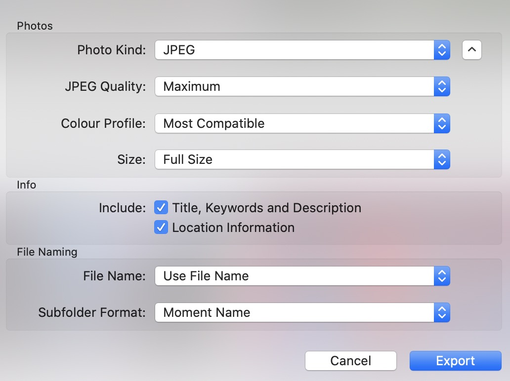

# irenamer
 

The script rename macOS photos folders name format after iPhoto export 

"Place, 24 April 2020" -> "2020-04-24 Place" or 
"24 April 2020" -> "2020-04-24"

To use the script:
1) export photos in such a way  

2) run script and provide a folder path to exported photos like ~/Downloads/temp/ with last "/" definitely
